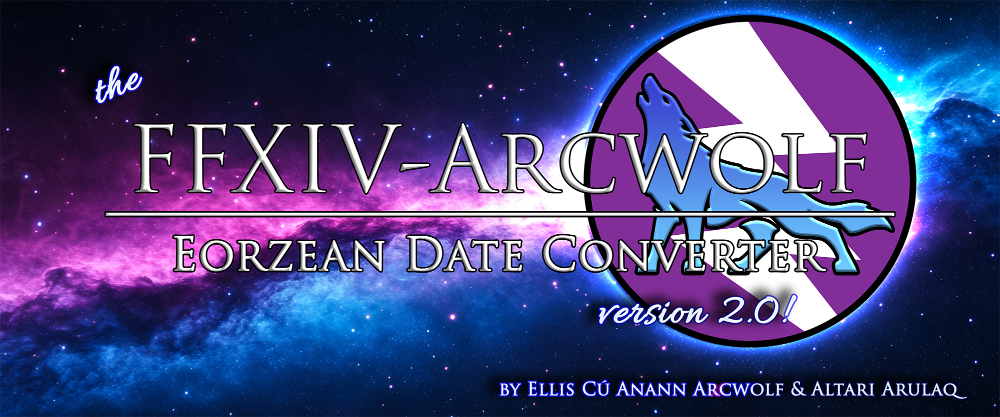

# The FFXIV-Arcwolf Eorzean Date Converter
## What Is it?
A lightweight, Vanilla JavaScript-based Eorzean Date Converter (EDC) implementing custom temporal-mapping algorithms. Features a responsive terminal-style UI, real-time synchronization, and local persistence. Developed to standardize date-tracking within complex narrative frameworks.
* **Ellis Arcwolf** programmed the app.
* **Altari Arulaq** compiled Eorzean timeline data!
## Where Is it?
You can access the live, secure tool here: [**The FFXIV-Arcwolf Eorzean Date Converter v1.5**](https://edc.jijivisa.org)
* **For Users**: Just visit the link. On mobile devices, tap "Add to Home Screen" to install it as a standalone app.
* **For Developers**: The source code is hosted right here. The logic is contained entirely within src/index.js for easy auditing or forking.
If you do decide to fork, please *be gentle.* It's my first app.
### How Does It Work?
If you *hate* math, and you'd rather just learn how it works in a pretty, enchanting way that avoids numbers as much as humanly possible, you've come to the right place. Click on the purple-dot-led line below to see the **FFXIV-Arcwolf EDC Visual Guide**.

  
🟣 The FFXIV-Arcwolf EDC Visual Guide

  
> ## The FFXIV-Arcwolf EDC Visual Guide
> Some people enjoy a good TL;DR. Well, I *suck* at those, so I gave my work to Notebook LM and let *it* do it. Then I proofread its work. Not bad. A few errors here or there, but nothing that couldn't be smoothed out. Good work, Notebook LM. For the more visual learner, enjoy this visual guide!
> 
> 
>
> 
> 
> 
> 
> 
> 
> 
> 
> 
> 
> 
> 
> 
> 
> 

### Changelog
* **1.5**: Earth dates with two Eorzean suns mapped to them will now display *both* dates, offering users either option for their own RP. Also resolved a related issue with leap years (and the in-game calendar assuming *all* Earth years are leap years). February 29ths on non-leap years are now safeguarded by the Accord Nexus.
* **1.0**: App is up! It changes Earth dates to Eorzean dates and sometimes gives you little tidbits about what was going in Eorzea on the year in question.
## Why Is It?
Because "static history" breaks immersion. The official game timeline exists in what Yoshi P. calls "[**Sazae-san space-time**](https://en.wikipedia.org/wiki/Floating_timeline)" where characters never age despite years of player activity. For many of us—from the neurodiverse and 'specially interested to the neurotypical and fanatical roleplayer—this stopped working *many* years ago. We needed a fix, and without intending to, the devs had always given us one. Right at the moment of character creation.

But that wasn't enough. To *really* sync up the *very* different Eorzean and Gregorian calendars, we needed something *more*. We needed **Lived Chronology**—a system that respects the passage of time experienced by the player and uses the fact that human beings store their **lived experiences** and the long-term passage of time (i.e. **lived chronology**) in totally different ways to its advantage.

**This converter solves two specific mathematical problems:**
* **The Isochronal Anchor**: By standardizing the Etheiryan Solar Year to match the Earth Solar Year, we allow characters to age naturally alongside their players. Yeah, this includes Viera, who may age slowly in body, but who continue to learn and grow wise with age and experience like the rest of us.
* **The Aught Revision**: The first version of the math used *fractions* and *floor functions*. Most people hate fractions and don't even know what floor functions are, and ultimately celebrating my character's nameday every January would have been weird, so I thought...this needs a *revision.* An ***Aught Revision***. To align the calendars perfectly, "Year Aught"—representing Year 0 of the 7th Umbral Era, immediately following the 7th Umbral Calamity, and taking place entirely over the span of Earth dates August 27, 2013, to December 31, 2013—utilizes a specific **time-dilation algorithm**. The app accelerates this 127-day period by 303.97% so that Year 1 of the 7th Umbral Era aligns perfectly with Earth Year 2014, ensuring flawless synchronization forever after.

### Need to Cite the Logic?
The honor is mine. <3
* **The Theory**: [Popping FFXIV's Time Bubble](https://open.substack.com/pub/murderofarcwolves/p/popping-ffxivs-time-bubble?utm_campaign=post-expanded-share&utm_medium=web)
* **The Math**: [The Aught Revision](https://open.substack.com/pub/murderofarcwolves/p/popping-ffxivs-time-v2-bubble-the-aught?utm_campaign=post-expanded-share&utm_medium=web)

[**Back to top**](#top)